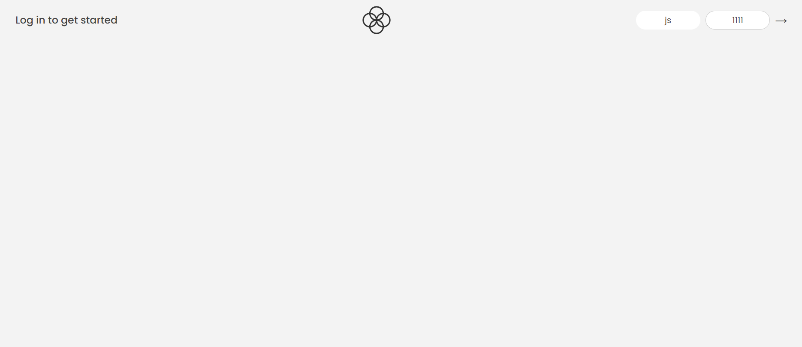
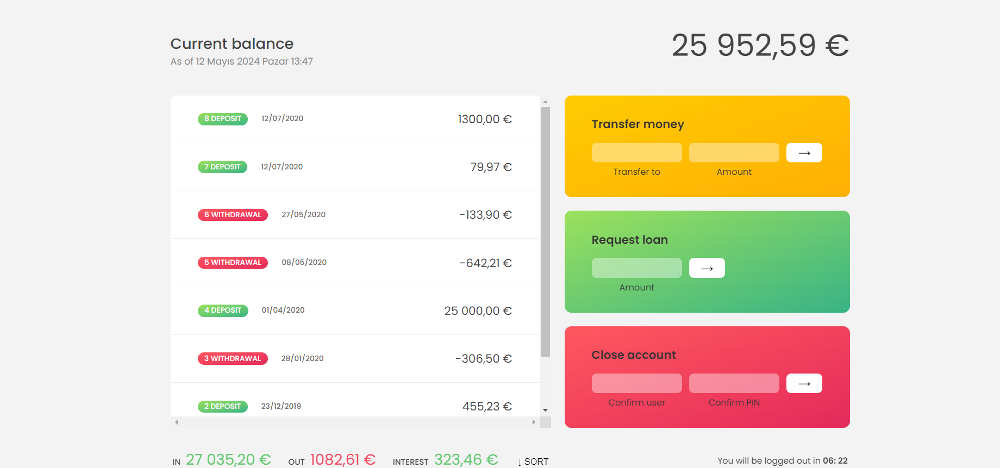
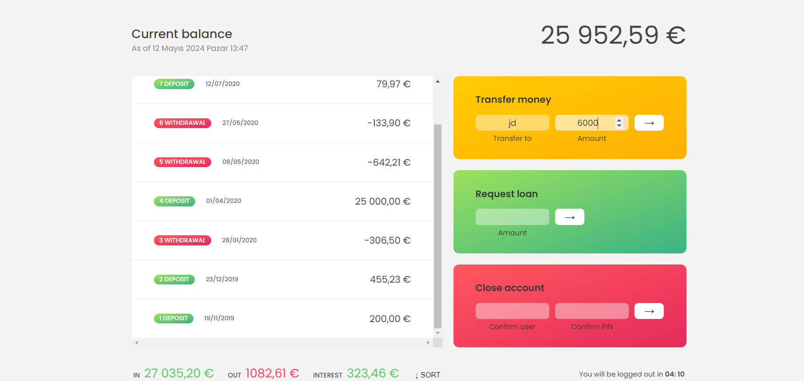
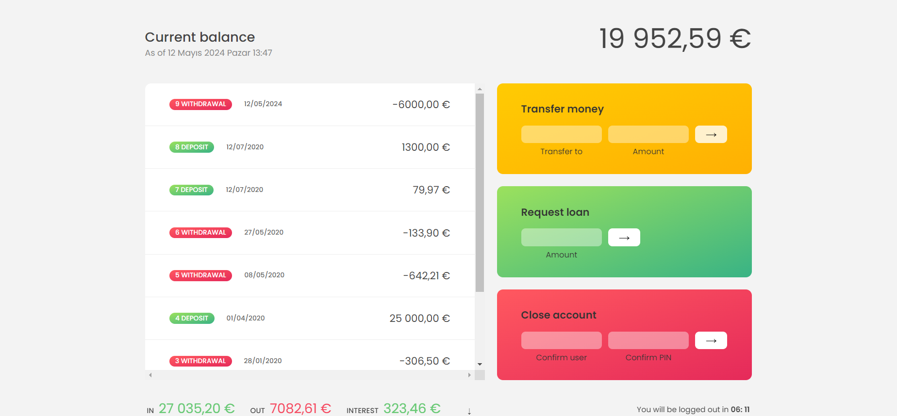
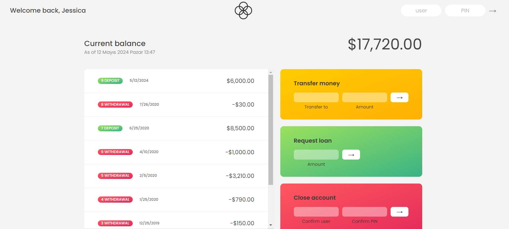

## What is Bank Statement project?

Bank Statement is a website hosted on Netlify. While I was coding the Bank Statement project, I practice usage of the features which is mentioned 10 - Arrays and 11 - Numbers-Dates-Timers in Javascript repository. You can send money, request loan or close your own account. You can login with js-1111 or jd-2222 as user-pin pair. Watch out the timer below the page😉. You can try by clicking <strong>[ Bank Statement ](https://bank-statement-gldn.netlify.app//)</strong>

#### Technologies Used:

- HTML, CSS, JavaScript for front-end development.
- Netlify for hosting the web application.

   
   
 
   
   
 
   
   
 
   
   
 
   
   
 

 
